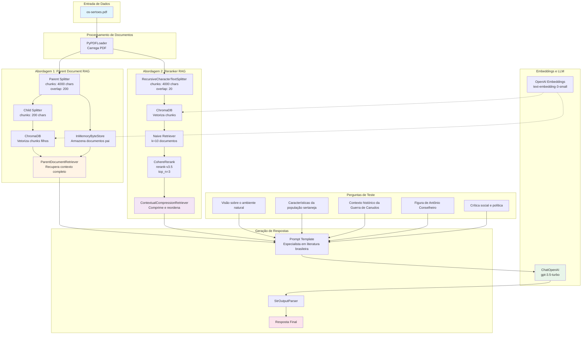

# Os Sertões - Sistema RAG (Retrieval-Augmented Generation)

## 📖 Sobre o Projeto

Este projeto implementa um sistema de **RAG (Retrieval-Augmented Generation)** para análise e consulta da obra clássica "Os Sertões" de Euclides da Cunha. O sistema utiliza técnicas avançadas de processamento de linguagem natural e recuperação de informação para responder perguntas sobre a obra de forma contextualizada e precisa.

## 🎯 Objetivo

Criar um assistente inteligente capaz de responder perguntas sobre "Os Sertões" utilizando duas abordagens diferentes de RAG:
- **Parent Document Retriever**: Recuperação hierárquica de documentos
- **Reranker RAG**: Recuperação com reordenação de resultados usando Cohere

## 🏗️ Arquitetura do Sistema



## 📊 Comparação das Abordagens

### Parent Document RAG (`parent_rag.ipynb`)

**Características:**
- **Chunking Hierárquico**: Divide documentos em chunks grandes (pais) e pequenos (filhos)
- **Chunks Filhos**: 200 caracteres - usados para busca vetorial
- **Chunks Pais**: 4000 caracteres com overlap de 200 - retornados como contexto
- **Vantagem**: Busca precisa com contexto amplo
- **Armazenamento**: InMemoryByteStore para documentos pais + ChromaDB para vetores

**Fluxo:**
1. Carrega PDF e divide em páginas
2. Cria chunks pais (4000 chars) e filhos (200 chars)
3. Armazena chunks filhos no ChromaDB para busca vetorial
4. Armazena chunks pais no InMemoryByteStore
5. Na consulta, busca pelos chunks filhos mais relevantes
6. Retorna os chunks pais correspondentes como contexto

### Reranker RAG (`reranker_rag.ipynb`)

**Características:**
- **Chunking Simples**: Divide documentos em chunks de 4000 caracteres com overlap de 20
- **Recuperação em Duas Etapas**:
  1. Naive Retriever: Busca os 10 documentos mais similares
  2. Cohere Rerank: Reordena e seleciona os 3 melhores
- **Vantagem**: Melhor precisão através de reordenação semântica
- **Modelo de Rerank**: Cohere rerank-v3.5

**Fluxo:**
1. Carrega PDF e divide em chunks de 4000 caracteres
2. Armazena chunks no ChromaDB
3. Na consulta, recupera 10 documentos candidatos
4. Usa Cohere Rerank para reordenar e selecionar os 3 melhores
5. Passa contexto comprimido para o LLM

## 🛠️ Tecnologias Utilizadas

- **LangChain**: Framework para desenvolvimento de aplicações com LLMs
- **OpenAI GPT-3.5-turbo**: Modelo de linguagem para geração de respostas
- **OpenAI Embeddings**: Geração de embeddings vetoriais
- **ChromaDB**: Banco de dados vetorial
- **Cohere Rerank**: Modelo de reordenação semântica
- **PyPDF**: Extração de texto de PDFs
- **Python 3.12**: Linguagem de programação

## 📦 Instalação

### Pré-requisitos

```bash
sudo apt update
sudo apt install python3.12-venv
```

### Configuração do Ambiente

```bash
# Criar ambiente virtual
python3 -m venv .venv

# Ativar ambiente virtual
source .venv/bin/activate

# Instalar dependências
pip install -r requirements.txt
pip install ipykernel
```

### Variáveis de Ambiente

Crie um arquivo `.env` na raiz do projeto com as seguintes chaves:

```env
OPENAI_API_KEY=sua_chave_openai
COHERE_API_KEY=sua_chave_cohere
```

## 🚀 Como Usar

### 1. Parent Document RAG

Abra o notebook `parent_rag.ipynb` e execute as células sequencialmente:

```python
# O notebook irá:
# 1. Carregar o PDF "os-sertoes.pdf"
# 2. Criar o sistema de recuperação hierárquica
# 3. Responder 5 perguntas sobre a obra
```

### 2. Reranker RAG

Abra o notebook `reranker_rag.ipynb` e execute as células sequencialmente:

```python
# O notebook irá:
# 1. Carregar o PDF "os-sertoes.pdf"
# 2. Criar o sistema de recuperação com reranking
# 3. Responder as mesmas 5 perguntas para comparação
```

## 📝 Perguntas de Teste

O sistema foi testado com as seguintes perguntas:

1. Qual é a visão de Euclides da Cunha sobre o ambiente natural do sertão nordestino e como ele influencia a vida dos habitantes?
2. Quais são as principais características da população sertaneja descritas por Euclides da Cunha? Como ele relaciona essas características com o ambiente em que vivem?
3. Qual foi o contexto histórico e político que levou à Guerra de Canudos, segundo Euclides da Cunha?
4. Como Euclides da Cunha descreve a figura de Antônio Conselheiro e seu papel na Guerra de Canudos?
5. Quais são os principais aspectos da crítica social e política presentes em "Os Sertões"? Como esses aspectos refletem a visão do autor sobre o Brasil da época?

## 🔍 Detalhes Técnicos

### Configurações do LLM

- **Modelo**: gpt-3.5-turbo
- **Max Tokens**: 200 (Parent RAG) / 500 (Reranker RAG)
- **Temperatura**: Padrão

### Configurações de Chunking

**Parent Document RAG:**
- Parent chunks: 4000 caracteres, overlap 200
- Child chunks: 200 caracteres

**Reranker RAG:**
- Chunks: 4000 caracteres, overlap 20
- Retrieval: Top 10 → Rerank para Top 3

## 📄 Estrutura do Projeto

```
Os-Sertoes-RAG/
├── os-sertoes.pdf           # Documento fonte
├── parent_rag.ipynb         # Implementação Parent Document RAG
├── reranker_rag.ipynb       # Implementação Reranker RAG
├── requirements.txt         # Dependências do projeto
├── makefile                 # Comandos de instalação
├── .env                     # Variáveis de ambiente (não versionado)
├── LICENSE                  # Licença do projeto
└── README.md               # Este arquivo
```

## 🎓 Conceitos Aplicados

- **RAG (Retrieval-Augmented Generation)**: Técnica que combina recuperação de informação com geração de texto
- **Embeddings**: Representação vetorial de texto para busca semântica
- **Chunking**: Divisão de documentos em partes menores para processamento
- **Reranking**: Reordenação de resultados para melhorar relevância
- **Vector Database**: Armazenamento e busca eficiente de embeddings

## 📊 Resultados

Ambas as abordagens foram capazes de responder às perguntas com contexto relevante da obra "Os Sertões". A escolha entre elas depende do caso de uso:

- **Parent Document RAG**: Melhor para contextos mais amplos e respostas detalhadas
- **Reranker RAG**: Melhor para precisão e relevância máxima com contexto focado

## 📜 Licença

Este projeto está sob a licença especificada no arquivo LICENSE.

## 🤝 Contribuições

Contribuições são bem-vindas! Sinta-se à vontade para abrir issues ou pull requests.
